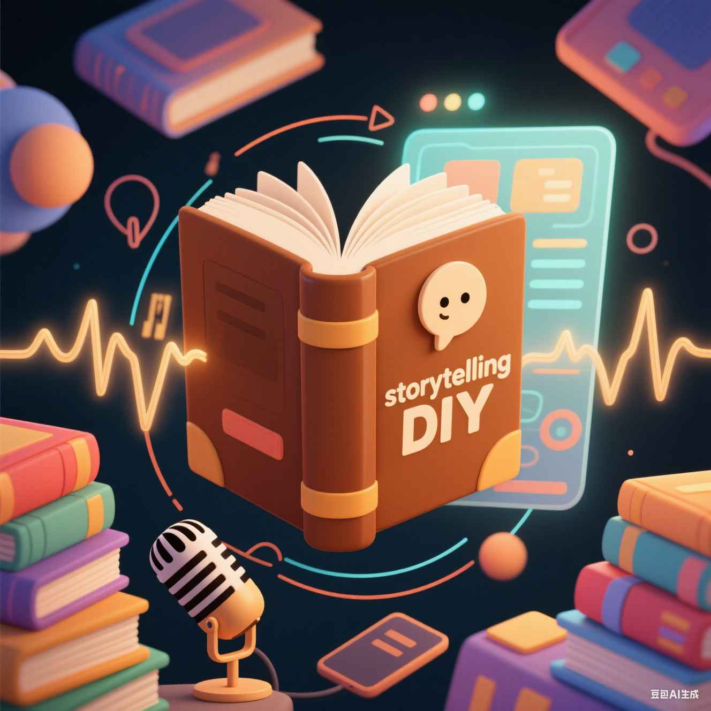
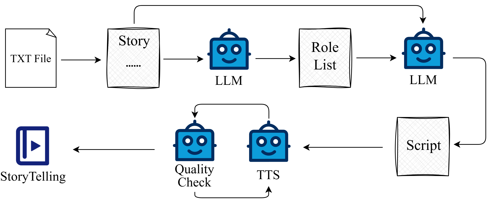

<div align="center">
    <h1>
    StoryTelling DIY
    </h1>
    
</div>

## Overview
This is an open-source project for generating audiobooks from novels. It modularizes audiobook text processing and speech synthesis (TTS) functionalities through APIs, making it easy for users to replace models and algorithms with their own. The project is licensed under the GNU General Public License v3.0 (GPL-3.0), ensuring that it remains free and open for everyone to use, modify, and distribute.

## Key Features

<p align="center">
  
</p>
<p align="center"><em>Our framework flowchart.</em></p>


* Organizes LLM, TTS, and quality evaluation modules to work together via flexible API services
* Provides an extensible framework that can be customized to meet individual needs
* Includes a powerful word-level emotion-controlled TTS model
* Comes with a speaker database of 100 speakers

## Get Started

* Create a conda environment
    ```shell
    conda create -n storytelling python==3.10
    ```

* Install dependencies
    
    ```shell
    pip install -r requirements.txt
    ```

* Run APIs for LLM, TTS, and QualityCheck
    ```shell
    bash wescon/run_narration.sh # narration generation
    bash wescon/run.sh # multi-role dialogue generation
    bash llm/run.sh # LLM
    bash filter/run.sh # phoneme error rate, speaker similarity, emotion similarity checks
    ```

* Run the UI for creation
    ```shell
    bash run.sh
    ```

## License

This project is licensed under the GNU General Public License v3.0 (GPL-3.0). See the [LICENSE](https://github.com/wangtianrui/VocalStory/blob/main/LICENSE) file for more details.

## Credits 

* Main Contributors
    <p align="center">  &nbsp;&nbsp;&nbsp;&nbsp;  &nbsp;&nbsp;&nbsp;&nbsp;  &nbsp;&nbsp;&nbsp;&nbsp;  </p>

* Special thanks to the following projects

    * [audiobook-creator](https://github.com/prakharsr/audiobook-creator)
